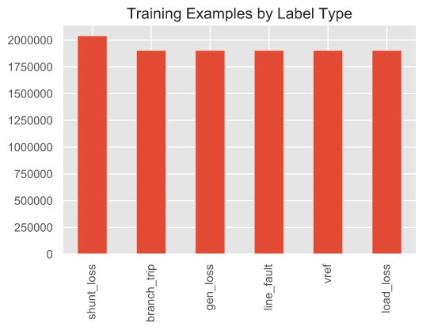
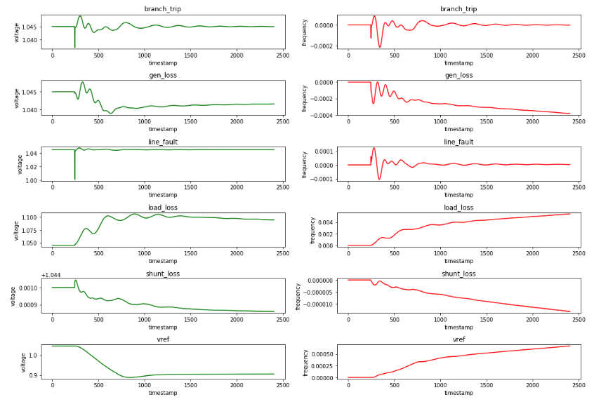
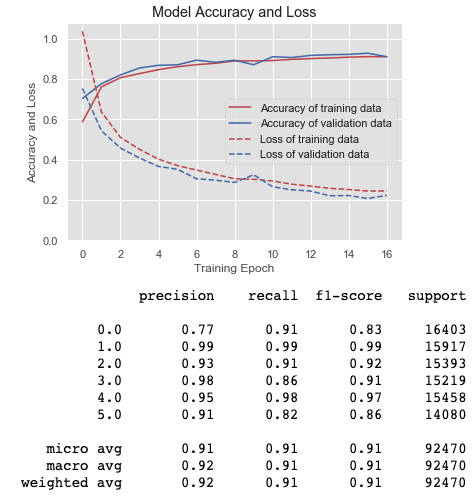
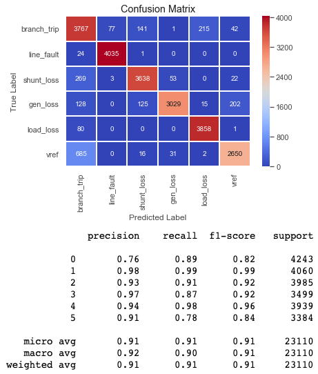
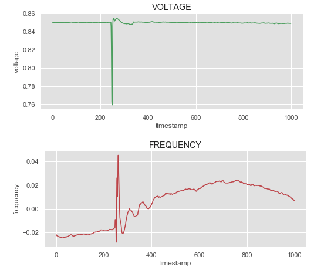
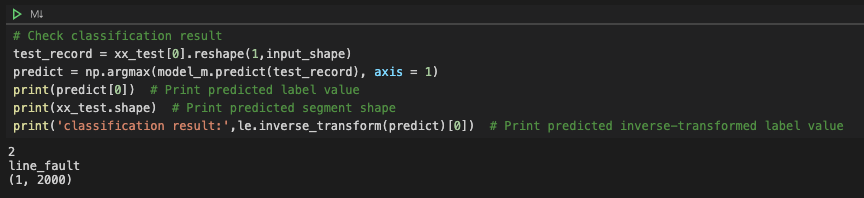

# PMU-pattern-recognition
## Deep Learning using Keras Neural Network model with TensorFlow

*The code shows the entire process of training Neural Network model and as a result, classifying PMU accident data.*

- **MATLAB Simulation Data**
  - https://www.dropbox.com/sh/lrytx2thocrq3s8/AADLm601ANv3WoIJgta-SMqoa?dl=0
- **Refer to the 'PMU-Pattern-Recognition.ipynb' for the detailed process and annotation.**
- **Execution order**
  1. SQL-Datahog-1cy.ipynb (Run SQL-Datahog-2cy.ipynb to add more data)
  2. Manually save CSV file to SQL Database
  3. PMU-Pattern-Recognition.ipynb
  4. To load the model and classify directly, run Model-Road.ipynb

## Summary

MATLAB simul data is used to train the model. Below is the total training examples visualized by label type.

The objective of this project is to classify the given input into 6 different accident types; Branch Trip, Generation Loss, Line Fault, Load Loss, Shunt Loss, and V Reference.

Necessary process before training such as data preprocessing, training/test data division, normalization, model tuning etc. is applied in order to get the accurate result.

Below shows the accuracy and loss of the the neural network training result.

We can check the accuracy of classified labels using confusion matrix.

Now we want to apply real-world data to classification. Here is the example of the PMU dataset. This is the line fault accident recorded in Siheung power system on July, 2nd.

Not the fancy one, but the classification result appears to be line fault. Same process can be done with the different input 'MIGEUM_0625.csv' in 'PMU-dataset' folder. 

